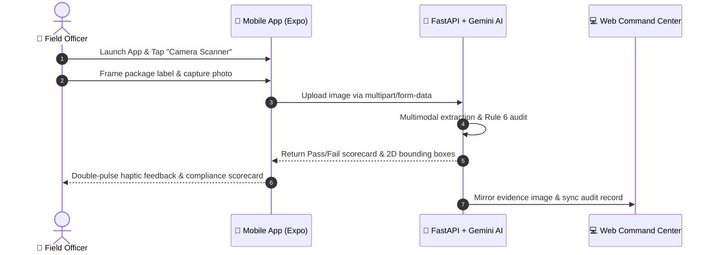

# Legal Metrology Mobile Field Scanner 📱📦

[](https://github.com/AllikaSaiHarsha/legal-metrology-app/actions/workflows/ci.yml)
[](https://reactnative.dev)
[](https://expo.dev)
[](https://www.typescriptlang.org)
[](LICENSE)

> 📦 **Legal Metrology Vision Ecosystem**  
> 📱 [Mobile Field Scanner App](https://github.com/AllikaSaiHarsha/legal-metrology-app) • 💻 [Web Command Center](https://github.com/AllikaSaiHarsha/legal-metrology-web) • 🧠 [AI Vision Backend](https://github.com/AllikaSaiHarsha/legal-metrology-backend)

The **Legal Metrology Mobile Field Scanner** is a native cross-platform mobile application (iOS & Android) engineered specifically for on-site enforcement officers inspecting packaged consumer goods in retail markets across India.

It connects directly to the [FastAPI Multimodal AI Backend](https://github.com/AllikaSaiHarsha/legal-metrology-backend) to perform instant, on-device packaging audits against **Rule 6 of the Legal Metrology (Packaged Commodities) Rules, 2011**.

---

## 🧐 What Problem Does the Mobile App Solve?

Field officers inspecting grocery stores, supermarkets, and wholesale markets frequently inspect hundreds of packages per shift. They face several operational bottlenecks:
* **Manual Inspection Fatigue:** Reading tiny text on glossy, curved, or reflective packaging causes high error rates.
* **Lack of Real-Time Legal Guidance:** Officers must manually reference legal clause requirements (e.g., whether Unit Sale Price is mandatory for a given package weight).
* **Delayed Data Entry:** Physical paperwork filled out during on-site market raids often takes days to be typed into central databases.

### The Mobile Solution:
With this app, an inspector points their smartphone camera at any package label, captures a photograph with tactile haptic feedback, and receives an **instant 3-second Rule 6 compliance scorecard** with live synchronization to the headquarters [Web Command Center](https://github.com/AllikaSaiHarsha/legal-metrology-web).

---

## 📱 How to Use the Mobile App (Field Workflow)



### 1. Launch & Dashboard
- Launch the app on your Android or iOS device via Expo Go or standalone preview APK.
- The dashboard displays recent field scan statistics and quick actions.

### 2. Capture a Packaging Photograph
- Tap the **Camera / Scan** button in the floating glassmorphic navigation bar.
- Align the product packaging within the framing reticle.
- Tap the shutter button (triggers physical tactile haptics via `expo-haptics`).
- You can also pick an existing packaging photograph from the device gallery.

### 3. Review Instant Statutory Verdicts
- The screen displays the analyzed label with an itemized statutory breakdown:
  - **MRP & Unit Sale Price:** Verifies inclusive of all taxes and ₹ per g/ml formatting.
  - **Net Quantity / Weight:** Verifies standard metric units (g, kg, ml, l).
  - **Manufacturer / Importer:** Confirms complete name, address, and consumer care hotline/email.
  - **Expiry / Best Before:** Validates date legibility.
- Items are color-coded: **Green (Passed)** or **Red (Violation Detected)**.

### 4. Automatic Cloud Synchronization
- Every completed field audit is automatically synchronized to the cloud PostgreSQL database and mirrored in real time to the administrative [Web Command Center](https://legal-metrology-web.vercel.app), allowing headquarters supervisors to issue violation notices immediately.

---

## 🛠️ Architecture & Mobile Tech Stack

* **Framework:** React Native with Expo SDK 57 (New Architecture enabled)
* **Language:** TypeScript 5
* **Navigation:** React Navigation (Native Stack + Custom Floating Glassmorphic Tab Bar)
* **Camera & Media:** `expo-image-picker` with native permissions handling
* **Tactile Haptics:** `expo-haptics` (shutter click & status confirmation vibration)
* **Styling & UI:** Expo Linear Gradient, React Native Reanimated, Expo Blur
* **Distribution:** Expo Application Services (EAS) with Over-The-Air (OTA) runtime updates

---

## 🚀 Local Development & Running

### Prerequisites
* Node.js 18.18+ or 20+
* [Expo Go](https://expo.dev/go) installed on your Android or iOS phone, OR an Android Studio / Xcode emulator.

### Setup Steps

1. **Clone the repository:**
   ```bash
   git clone https://github.com/AllikaSaiHarsha/legal-metrology-app.git
   cd legal-metrology-app
   ```

2. **Install dependencies:**
   ```bash
   npm install
   ```

3. **Configure Environment Variables:**
   ```bash
   cp .env.example .env
   # Set EXPO_PUBLIC_API_URL to your FastAPI backend URL (e.g. https://legal-metrology-backend-dhto.onrender.com)
   ```

4. **Start the Expo Development Server:**
   ```bash
   npx expo start
   ```

5. **Run on Device or Simulator:**
   - Scan the QR code in your terminal with the **Expo Go** app (Android) or the Camera app (iOS).
   - Press `a` in the terminal for Android Emulator.
   - Press `i` in the terminal for iOS Simulator.

6. **Verify TypeScript Types:**
   ```bash
   npm run typecheck
   ```

---

## 📄 License

This project is licensed under the [MIT License](LICENSE).
